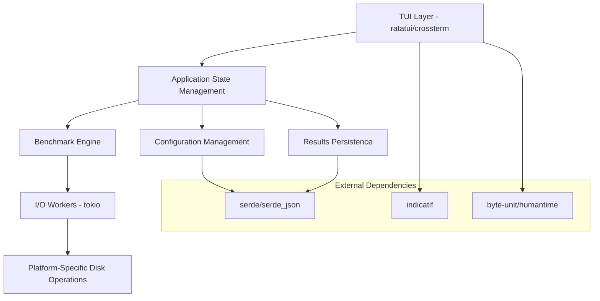

# Design Document

## Overview

DIORB is a cross-platform TUI application built in Rust that provides disk performance benchmarking with real-time feedback. The application follows a modular architecture with clear separation between the TUI layer, benchmark engine, and platform-specific I/O operations. The design prioritizes performance, accuracy, and user experience while maintaining cross-platform compatibility.

## Architecture

The application uses a layered architecture with the following components:



### Core Principles

1. **Async-First Design**: Uses tokio runtime for non-blocking I/O operations
2. **Modular Structure**: Each module under 400 lines of code with minimal cross-dependencies
3. **Platform Abstraction**: OS-specific optimizations hidden behind common interfaces
4. **Real-time Feedback**: Streaming results from workers to UI with minimal latency

## Components and Interfaces

### Main Application (`src/main.rs`)
- Initializes tokio runtime
- Sets up TUI terminal
- Manages application lifecycle
- Handles graceful shutdown

### Library Root (`src/lib.rs`)
- Public re-exports for clean API
- Common types and traits
- Error handling definitions

### Configuration System (`src/config.rs`)
```rust
pub struct BenchmarkConfig {
    pub disk_path: PathBuf,
    pub mode: BenchmarkMode,
    pub file_size: u64,
    pub block_size: u64,
    pub duration: Duration,
    pub thread_count: usize,
    pub keep_temp_files: bool,
}

pub enum BenchmarkMode {
    SequentialWrite,
    SequentialRead,
    RandomReadWrite,
    Mixed { read_ratio: f32 },
}
```

### Benchmark Engine (`src/bench/`)

#### Worker Management (`src/bench/worker.rs`)
- Spawns async tasks for I/O operations
- Streams real-time results via channels
- Manages thread pool for blocking operations
- Coordinates multiple benchmark modes

#### Sequential Operations (`src/bench/sequential.rs`)
- Implements linear read/write patterns
- Uses large block sizes (64 KiB default)
- Optimized for throughput measurement
- Handles temporary file lifecycle

### I/O Abstraction (`src/io/disk.rs`)
Platform-specific optimizations:

**Windows Implementation:**
```rust
pub fn open_direct_write(path: &Path) -> io::Result<File> {
    // FILE_FLAG_WRITE_THROUGH | FILE_FLAG_NO_BUFFERING
    // Custom Windows API calls for unbuffered I/O
}
```

**Unix Implementation:**
```rust
pub fn open_direct_write(path: &Path) -> io::Result<File> {
    // O_DIRECT with fsync fallback
    // Platform detection for optimal flags
}
```

### TUI System (`src/app/`)

#### Terminal Management (`src/app/tui.rs`)
- Initializes crossterm backend
- Manages screen clearing and restoration
- Handles terminal size changes
- Implements event loop

#### Screen Components (`src/app/screens/`)

**Start Screen (`start.rs`)**
- Main menu with navigation
- Quick access to common operations
- Application status display

**Configuration Screen (`config.rs`)**
- Drop-down menus for all parameters
- Input validation and constraints
- Real-time preview of settings

**Running Screen (`running.rs`)**
- Live statistics display (MB/s, IOPS, latency)
- Progress bar with time estimates
- Cancellation handling

**Results Screen (`results.rs`)**
- Comprehensive benchmark summary
- Historical data comparison
- Export and save functionality

## Data Models

### Benchmark Results (`src/models/result.rs`)
```rust
pub struct BenchmarkResult {
    pub timestamp: DateTime<Utc>,
    pub config: BenchmarkConfig,
    pub metrics: PerformanceMetrics,
    pub system_info: SystemInfo,
}

pub struct PerformanceMetrics {
    pub bytes_processed: u64,
    pub elapsed_time: Duration,
    pub throughput_mbps: f64,
    pub iops: f64,
    pub latency: LatencyStats,
}

pub struct LatencyStats {
    pub min: Duration,
    pub avg: Duration,
    pub max: Duration,
    pub percentiles: HashMap<u8, Duration>, // 50th, 95th, 99th
}
```

### Utility Modules (`src/util/`)

#### Units Helper (`src/util/units.rs`)
- Human-readable size formatting
- Duration parsing and display
- Rate calculations and conversions
- Cross-platform path handling

## Error Handling

### Error Types
```rust
pub enum DIOrbError {
    IoError(io::Error),
    ConfigError(String),
    BenchmarkError(String),
    TuiError(String),
}
```

### Error Propagation Strategy
1. **I/O Errors**: Bubble up with context about operation
2. **Configuration Errors**: User-friendly messages with suggestions
3. **Benchmark Errors**: Detailed diagnostics for troubleshooting
4. **TUI Errors**: Graceful degradation with fallback displays

### Recovery Mechanisms
- Automatic retry for transient I/O failures
- Fallback to synchronous I/O if async fails
- Graceful handling of insufficient permissions
- Clean temporary file removal on errors

## Testing Strategy

### Unit Testing
- Each module has comprehensive unit tests
- Mock I/O operations for deterministic testing
- Configuration validation testing
- Utility function verification

### Integration Testing
- End-to-end benchmark workflows
- Cross-platform I/O behavior validation
- TUI interaction simulation
- Performance regression detection

### Performance Testing
- Accuracy validation against known benchmarks
- Latency measurement precision testing
- Memory usage profiling
- Startup time verification

### Platform Testing
- Windows: NTFS, ReFS file systems
- Linux: ext4, xfs, btrfs file systems  
- macOS: APFS, HFS+ file systems
- Various storage types: SATA SSD, NVMe, HDD

## Implementation Considerations

### Async I/O Strategy
- Use `tokio::task::spawn_blocking` for sync I/O to avoid reactor blocking
- Stream results via `tokio::sync::mpsc` channels
- Implement backpressure handling for high-throughput scenarios

### Memory Management
- Pre-allocate buffers for I/O operations
- Reuse buffer pools to minimize allocations
- Monitor memory usage during large file operations

### Cross-Platform Compatibility
- Abstract platform differences behind common traits
- Use conditional compilation for OS-specific optimizations
- Maintain consistent behavior across platforms

### Performance Optimizations
- Direct I/O bypass for accurate measurements
- Optimal block size selection based on storage type
- Parallel I/O operations where beneficial
- Efficient progress reporting without measurement interference